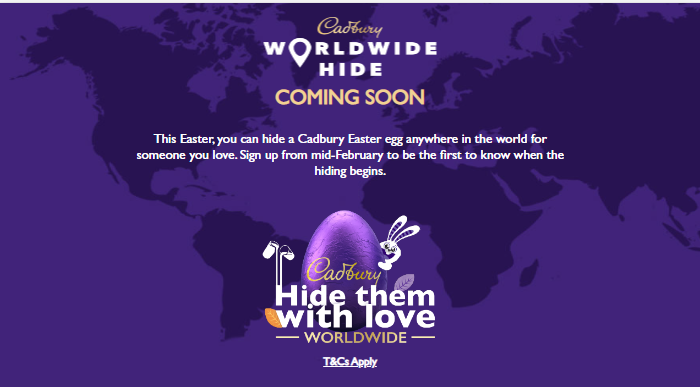

# Wunderman Thompson South Africa - Cadbury Easter Landing Page

## Table of contents

- [Overview](#overview)
  - [Screenshot](#screenshot)
  - [Links](#links)
- [My process](#my-process)
  - [Built with](#built-with)
  - [What I learned](#what-i-learned)
- [Author](#author)

### Screenshot

### Links

- Solution URL: [Link to Soulution](https://github.com/nonoza/Wunderman-Thompson-SA/tree/main/cadbury-easter-landing-page)
- Live Site URL: [Link to Live](https://nonoza.github.io/Wunderman-Thompson-SA/cadbury-easter-landing-page//)

## My process
- Started with the HTML to build a structure of the page.
- Styled the page using CSS for both Mobile and Desktop.

 
### Built with

- Semantic HTML5 markup
- CSS custom properties

### What I learned

- Mobile first is important.
- Learned about Responsive typography.

### Useful resources

- [Responsive typography](https://css-tricks.com/snippets/css/fluid-typography/) 

## Author

- Website - [Pretty Kunene](http://prettynkunene.co.za/)
- Frontend Mentor - [@nonoza](https://www.frontendmentor.io/profile/nonoza)

